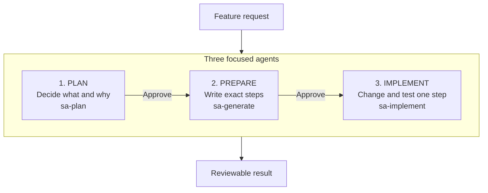
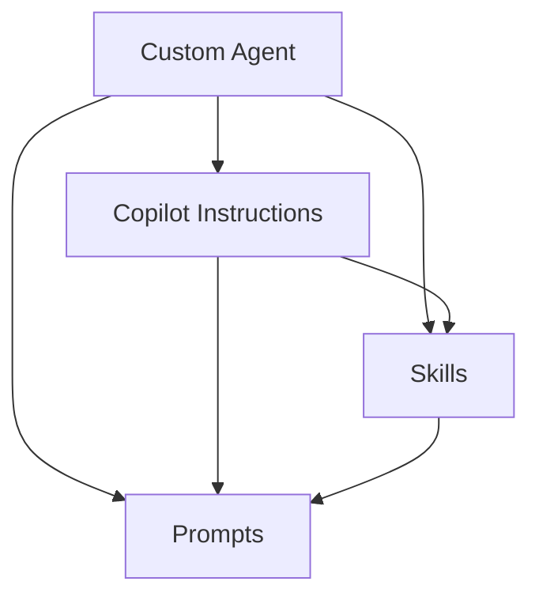
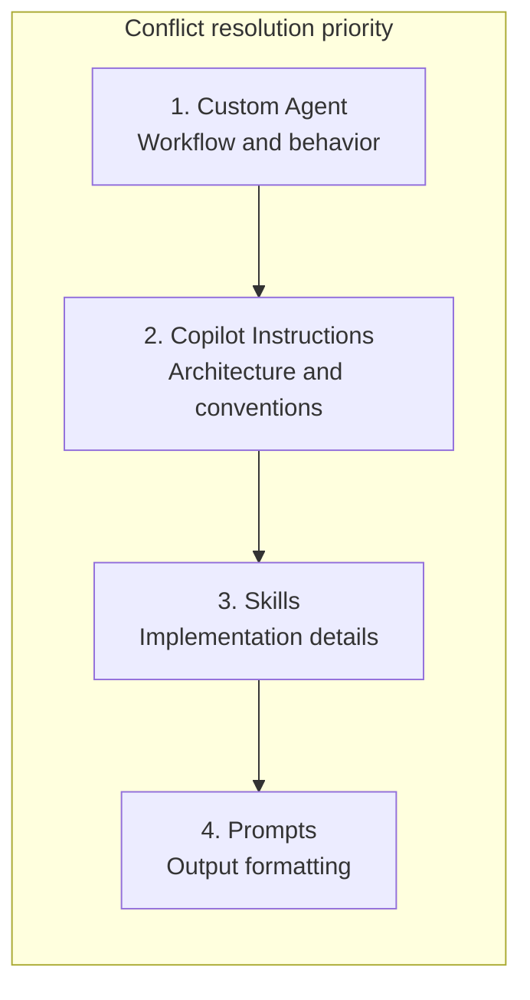
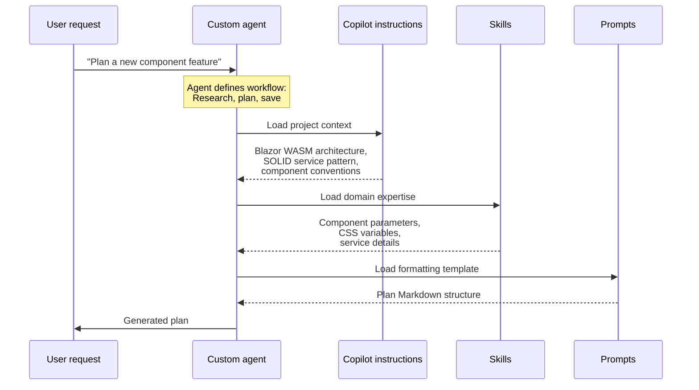
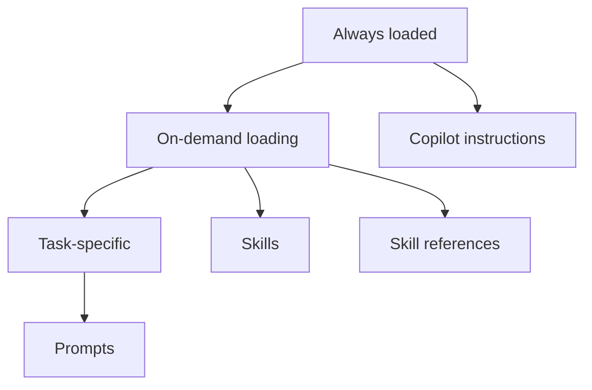
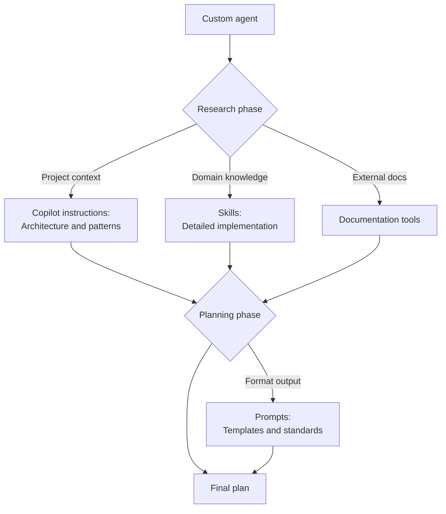
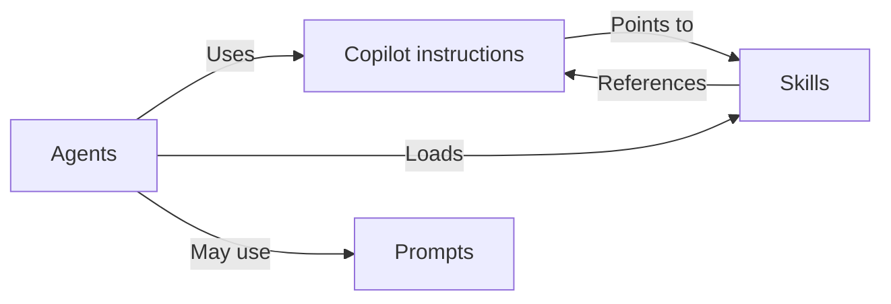
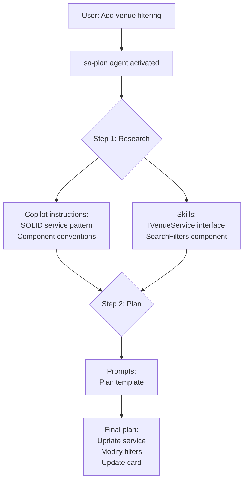

# Structured Autonomy: Why We Use Custom Agents

> **Short version:** A custom prompt asks for one focused result. A custom agent owns a stage of work, with defined tools, boundaries, handoffs, and review checkpoints.

## Workflow at a glance

This repository separates deciding, preparing, and doing so implementation never starts from an unreviewed idea.

```mermaid
flowchart TB
    Request["Feature request"] --> Workflow

    subgraph Workflow["Three focused agents"]
        direction LR
        Plan["1. PLAN<br/>Decide what and why<br/>sa-plan"] -->|Approve| Prepare["2. PREPARE<br/>Write exact steps<br/>sa-generate"]
        Prepare -->|Approve| Implement["3. IMPLEMENT<br/>Change and test one step<br/>sa-implement"]
    end

    Workflow --> Result["Reviewable result"]
```

## Custom agents vs. custom prompts

| Custom agents - used for delivery | Custom prompts - useful for one focused task |
|---|---|
| Own a clear role for one stage of work | Package a reusable request for one result |
| Use stage-specific tools and boundaries | Usually inherit the current agent and its tools |
| Pass decisions through `plan.md` and `implementation.md` | Usually return one response in the current chat |
| Stop at explicit review checkpoints | Finish the requested task in one pass |
| Best for planning, handoffs, implementation, and validation | Best for drafting a PRD, summary, template, or standard response |

## What we gain

| Better output | Lower token usage |
|---|---|
| Research and scope are settled before code changes | Decisions are written once instead of repeated in every prompt |
| An approved plan becomes the source of truth | Each stage loads only the context and tools it needs |
| Exact implementation steps reduce interpretation gaps | The builder uses the handoff instead of repeating broad research |
| One small step is changed, validated, and reviewed at a time | Less rework means fewer corrective conversations |

> **Token note:** Agents do not automatically make every request cheaper. The savings come from scoped context, durable handoffs, and avoiding rework.

## Why each agent exists

| Agent | Plain-language job | Guardrail |
|---|---|---|
| `sa-plan` | Research the request and decide what should change | Writes only the plan; does not change product code |
| `sa-generate` | Turn the approved plan into exact, executable steps | Writes only the implementation guide; does not build or test |
| `sa-implement` | Apply and validate the next small step | Stops after one step so the result can be reviewed |

## Presenter takeaway

**Use a custom prompt when:** the task is focused and one good response completes it.

**Use custom agents when:** the work needs separate responsibilities, controlled tools, durable handoffs, and review gates.

**Bottom line:** Prompts standardize a request. Agents standardize responsibility and execution.

## AI guidance system logic

This repository also documents how its AI guidance components interact. The components form four layers, each with a separate purpose.

### System overview

```mermaid
graph TD
    A[Custom Agent] --> B[Copilot Instructions]
    A --> C[Skills]
    A --> D[Prompts]
    B --> C
    B --> D
    C --> D
```

### Component hierarchy and priority

```mermaid
flowchart LR
    subgraph Priority["Conflict resolution priority"]
        P1[1. Custom Agent<br/>Workflow and behavior]
        P2[2. Copilot Instructions<br/>Architecture and conventions]
        P3[3. Skills<br/>Implementation details]
        P4[4. Prompts<br/>Output formatting]

        P1 --> P2 --> P3 --> P4
    end
```

| Level | Source | Wins when | Example |
|-------|--------|-----------|---------|
| 1 | **Custom Agent** | Workflow and behavior | "Always research first, then plan" |
| 2 | **Copilot Instructions** | Architecture and conventions | "Use interface + mock pattern" |
| 3 | **Skills** | Implementation details | `IVenueService.GetAllVenuesAsync()` signature |
| 4 | **Prompts** | Output formatting | "Use this Markdown template" |

### Component purposes

#### Custom agents

- **Role:** Specialized behavior and workflows
- **Content:** Task-specific instructions, tool usage, multi-step processes
- **Example:** `sa-plan.agent.md` defines a planning workflow
- **When loaded:** Agent activation
- **Scope:** Agent-specific behavior

#### Copilot instructions

- **Role:** Project foundation and onboarding
- **Content:** Architecture overview, critical patterns, development workflows
- **Example:** Blazor WASM structure, SOLID service pattern, CSS variables
- **When loaded:** Always, as foundational context
- **Scope:** Project-wide conventions

#### Skills

- **Role:** Deep domain expertise
- **Content:** Complete API references, detailed patterns, comprehensive examples
- **Example:** The `mypetvenunes` skill with its component catalog and service interfaces
- **When loaded:** On demand based on task type
- **Scope:** Domain-specific knowledge

#### Prompts

- **Role:** Standardized templates and formats
- **Content:** Task templates, output formatting, reusable prompt components
- **Example:** PRD templates and plan formats
- **When loaded:** When specific formatting is needed
- **Scope:** Output consistency

### Real-world interaction flow

```mermaid
sequenceDiagram
    participant U as User request
    participant A as Custom agent
    participant C as Copilot instructions
    participant S as Skills
    participant P as Prompts

    U->>A: "Plan a new component feature"
    Note over A: Agent defines workflow:<br/>Research, plan, save
    A->>C: Load project context
    C-->>A: Blazor WASM architecture,<br/>SOLID service pattern,<br/>component conventions
    A->>S: Load domain expertise
    S-->>A: Component parameters,<br/>CSS variables,<br/>service details
    A->>P: Load formatting template
    P-->>A: Plan Markdown structure
    A->>U: Generated plan
```

### Information flow patterns

#### Progressive disclosure

```mermaid
graph TD
    Always[Always loaded] --> OnDemand[On-demand loading] --> Specific[Task-specific]
    Always --> CI[Copilot instructions]
    OnDemand --> SK[Skills]
    OnDemand --> SR[Skill references]
    Specific --> PR[Prompts]
```

#### Context combination strategy

When an agent works on MyPetVenues:

```mermaid
flowchart TD
    Agent[Custom agent] --> Research{Research phase}
    Research -->|Project context| CI[Copilot instructions:<br/>Architecture and patterns]
    Research -->|Domain knowledge| Skills[Skills:<br/>Detailed implementation]
    Research -->|External docs| Tools[Documentation tools]
    CI --> Planning{Planning phase}
    Skills --> Planning
    Tools --> Planning
    Planning -->|Format output| Prompts[Prompts:<br/>Templates and standards]
    Planning --> Output[Final plan]
    Prompts --> Output
```

### Best practices for combining components

#### 1. Complementary, not conflicting

- Each component serves a distinct purpose.
- Information should not be duplicated across components.
- When conflicts arise, follow the priority hierarchy.

#### 2. Reference relationships

```mermaid
graph LR
    CI[Copilot instructions] -->|"Points to"| S[Skills]
    S -->|"References"| CI
    A[Agents] -->|"Uses"| CI
    A -->|"Loads"| S
    A -->|"May use"| P[Prompts]
```

#### 3. Update coordination

When making changes:

- Update copilot instructions for architectural changes.
- Update skills for implementation pattern changes.
- Ensure agent workflows remain compatible.
- Keep prompts synchronized with output expectations.

### Example: adding a new feature

```mermaid
flowchart TD
    Request[User: Add venue filtering]
    --> Agent[sa-plan agent activated]
    --> Step1{Step 1: Research}
    Step1 --> CI[Copilot instructions:<br/>SOLID service pattern<br/>Component conventions]
    Step1 --> Skills[Skills:<br/>IVenueService interface<br/>SearchFilters component]
    CI --> Step2{Step 2: Plan}
    Skills --> Step2
    Step2 --> Template[Prompts:<br/>Plan template]
    Template --> Output[Final plan:<br/>Update service<br/>Modify filters<br/>Update card]
```

This layered approach gives agents the context they need at the right time while keeping project conventions consistent.
