# AI Guidance System Logic - How Components Work Together

This document explains how different AI guidance components in this repository interact and combine to create a comprehensive system for AI agents.

## System Overview

Our AI guidance system consists of four distinct layers, each serving a specific purpose without overlap.

```mermaid
graph TD
    A[Custom Agent] --> B[Copilot Instructions]
    A --> C[Skills]
    A --> D[Prompts]
    B --> C
    B --> D
    C --> D
    
    A[🤖 Custom Agent<br/>sa-plan.agent.md<br/>Specialized Role & Workflow]
    B[📋 Copilot Instructions<br/>copilot-instructions.md<br/>Project Context & Architecture]
    C[🎯 Skills<br/>skills/mypetvenunes/<br/>Domain Expertise]
    D[📝 Prompts<br/>prompts/<br/>Task Templates]
```

## Component Hierarchy & Priority

### Priority Examples

| Level | Source | Wins When | Example |
|-------|--------|-----------|---------|
| 1 | **Custom Agent** | Workflow & behavior | "Always research first, then plan" |
| 2 | **Copilot Instructions** | Architecture & conventions | "Use interface + mock pattern" |
| 3 | **Skills** | Implementation details | "VenueService.GetAllVenuesAsync() signature" |
| 4 | **Prompts** | Output formatting | "Use this markdown template" |

## Component Purposes

### 🤖 Custom Agents
- **Role**: Specialized behavior and workflows
- **Content**: Task-specific instructions, tool usage, multi-step processes
- **Example**: `sa-plan.agent.md` defines planning workflow
- **When Loaded**: Agent activation
- **Scope**: Agent-specific behavior

### 📋 Copilot Instructions
- **Role**: Project foundation and onboarding
- **Content**: Architecture overview, critical patterns, development workflows
- **Example**: Blazor WASM structure, SOLID service pattern, CSS variables
- **When Loaded**: Always (foundational context)
- **Scope**: Project-wide conventions

### 🎯 Skills
- **Role**: Deep domain expertise
- **Content**: Complete API references, detailed patterns, comprehensive examples
- **Example**: `mypetvenunes` skill with component catalog, service interfaces
- **When Loaded**: On-demand based on task type
- **Scope**: Domain-specific knowledge

### 📝 Prompts
- **Role**: Standardized templates and formats
- **Content**: Task templates, output formatting, reusable prompt components
- **Example**: PRD templates, plan formats
- **When Loaded**: When specific formatting needed
- **Scope**: Output consistency

## Real-World Interaction Flow

```mermaid
sequenceDiagram
    participant U as User Request
    participant A as Custom Agent
    participant C as Copilot Instructions
    participant S as Skills
    participant P as Prompts
    
    U->>A: "Plan a new component feature"
    
    Note over A: Agent defines workflow:<br/>Research → Plan → Save
    
    A->>C: Load project context
    C-->>A: Blazor WASM architecture<br/>SOLID service pattern<br/>Component conventions
    
    A->>S: Load domain expertise
    S-->>A: Component parameter patterns<br/>CSS variable usage<br/>Service interface details
    
    A->>P: Load formatting template
    P-->>A: Plan markdown structure<br/>Output format standards
    
    Note over A: Combines all inputs<br/>following priority hierarchy
    
    A->>U: Generated plan following<br/>agent workflow + project patterns
```

## Information Flow Patterns

### Progressive Disclosure
Components use a three-level loading system:

### Context Combination Strategy

When an agent works on MyPetVenues:

## Best Practices for Combination

### 1. **Complementary, Not Conflicting**
- Each component serves a distinct purpose
- Information should not duplicate across components
- When conflicts arise, follow the priority hierarchy

### 2. **Reference Relationships**

### 3. **Update Coordination**
When making changes:
- Update copilot-instructions.md for architectural changes
- Update skills for implementation pattern changes  
- Ensure agent workflows remain compatible
- Keep prompts synchronized with output expectations

## Example: Adding a New Feature

This layered approach ensures that AI agents get the right information at the right level of detail for any given task, while maintaining consistency across the project.