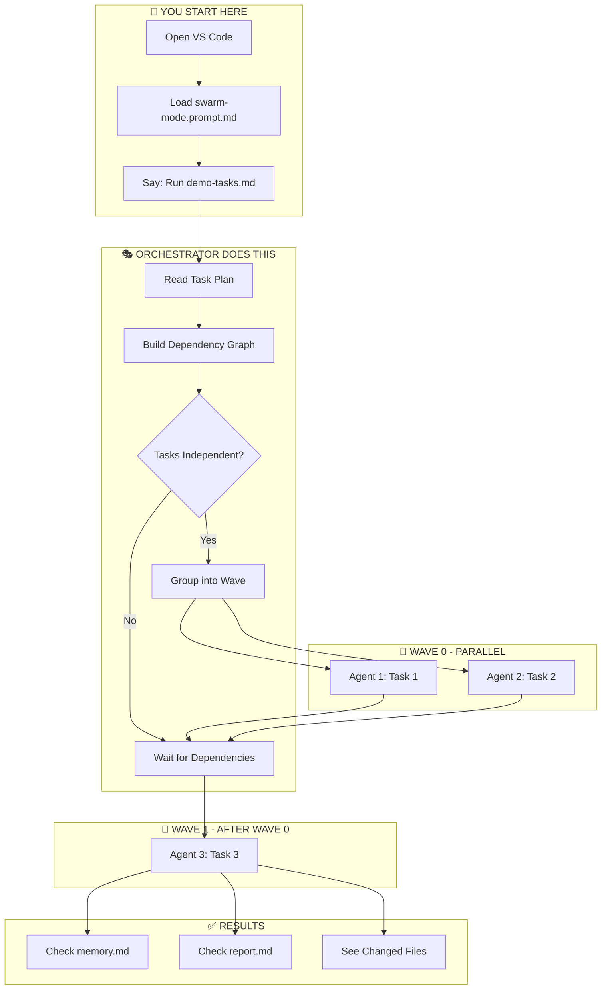
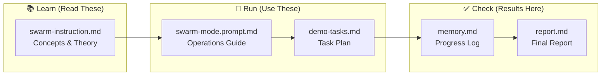
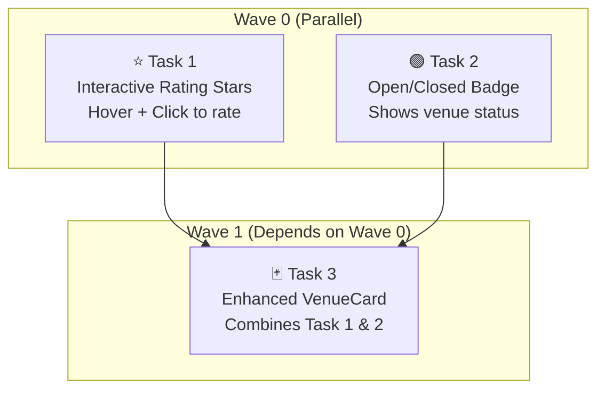
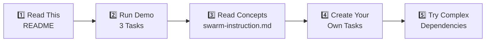

# 🐝 Swarm Mode Demo: Multi-Agent Orchestration

> **Learn how AI agents work together in parallel to complete tasks faster!**

This repository demonstrates **multi-agent orchestration** using GitHub Copilot CLI. Watch multiple AI agents work simultaneously on different tasks, then merge their work together.

---

## 🎯 What You'll Learn

| Concept | Description |
|---------|-------------|
| **Orchestrator** | The "boss" agent that assigns and tracks tasks |
| **Subagents** | Worker agents that each complete one task |
| **Waves** | Groups of tasks that can run in parallel |
| **Memory** | How agents communicate progress |

---

## 📋 Prerequisites

Before starting, you need:

- [ ] **VS Code** with GitHub Copilot extension
- [ ] **Git** installed and configured
- [ ] **.NET 9 SDK** (for the demo app)
- [ ] **GitHub Copilot CLI** (install below)

### Install Copilot CLI

```powershell
# Check if already installed
copilot -v

# If not installed, run:
winget install GitHub.Copilot.Prerelease
```

---

## 🗺️ How It Works



---

## 🚀 Quick Start (5 Steps)

### Step 1: Open VS Code
Open this folder in VS Code:
```powershell
code c:\Temp\GIT\simplepetapp
```

### Step 2: Open Copilot Chat
Press `Ctrl+Shift+I` (or click the Copilot icon)

### Step 3: Load the Orchestrator Prompt
In the chat, type:
```
@workspace /explain Use the prompt in .github/prompts/swarm-mode.prompt.md
```

Or attach the file directly and say:
```
Run the tasks in .docs/demo-tasks.md
```

### Step 4: Watch the Magic! ✨
You'll see:
1. Orchestrator analyzes the 3 tasks
2. Groups Task 1 & 2 into Wave 0 (parallel)
3. Creates separate workspaces for each
4. Launches 2 agents simultaneously
5. After both finish → runs Task 3
6. Generates final report

### Step 5: Check Results
Look at these files when done:
- `.docs/memory.md` - Progress log from each agent
- `.docs/report.md` - Final summary with metrics

---

## 📁 File Map



| File | Location | Purpose |
|------|----------|---------|
| This README | `README.md` | Start here! |
| Concepts | `.github/instructions/swarm-instruction.md` | Learn the theory |
| Operations | `.github/prompts/swarm-mode.prompt.md` | How to run agents |
| Task Plan | `.docs/demo-tasks.md` | The demo tasks |
| Progress | `.docs/memory.md` | Agent updates |
| Report | `.docs/report.md` | Final summary |

---

## 🌊 Understanding Waves

```mermaid
gantt
    title Sequential vs Parallel Execution
    dateFormat X
    axisFormat %s
    
    section Sequential 😴
    Task 1 (5 min)    :a1, 0, 5
    Task 2 (5 min)    :a2, after a1, 5
    Task 3 (4 min)    :a3, after a2, 4
    
    section Parallel 🚀
    Task 1 (5 min)    :b1, 0, 5
    Task 2 (5 min)    :b2, 0, 5
    Task 3 (4 min)    :b3, after b1, 4
```



**Key Insight**: Tasks 1 & 2 have no dependencies, so they run at the same time!

- **Sequential**: 5 + 5 + 4 = **14 minutes**
- **Parallel**: 5 + 4 = **9 minutes** (36% faster!)

---

## 📊 What the Demo Tasks Do

The demo adds 3 small features to the MyPetVenues app:



---

## ❓ Troubleshooting

### Copilot CLI not found
```powershell
winget install GitHub.Copilot.Prerelease
# Restart your terminal after installing
```

### Build errors
```powershell
dotnet build MyPetVenues/MyPetVenues.csproj
```

### Memory file not updating
Make sure agents have write access to `.docs/memory.md`

---

## 🎓 Learning Path



| Level | What to Do |
|-------|------------|
| **Beginner** | Run the 3-task demo, watch the report |
| **Intermediate** | Modify `demo-tasks.md`, add your own tasks |
| **Advanced** | Create multi-wave plans with complex dependencies |

---

## 🔑 Key Commands

```powershell
# Check Copilot CLI
copilot -v

# Build the app
dotnet build MyPetVenues/MyPetVenues.csproj

# Run the app (optional)
dotnet run --project MyPetVenues/MyPetVenues.csproj

# Check agent job status (during run)
Get-Job | Format-Table Name, State

# View agent output
Receive-Job -Name "agent-task1"
```

---

## 📝 Glossary

| Term | Meaning |
|------|---------|
| **Orchestrator** | Main agent that coordinates all work |
| **Subagent** | Worker agent doing one specific task |
| **Wave** | Group of independent tasks that run in parallel |
| **Worktree** | Isolated Git workspace for each agent |
| **Memory** | Shared file (`.docs/memory.md`) for progress tracking |

---

## � Worktrees vs Branches

**Why not just use branches?**

| Branch | Worktree |
|--------|----------|
| Just a pointer to commits | A **full separate folder** with files |
| One branch checked out at a time | Multiple branches checked out simultaneously |
| `git checkout` switches files in place | Each worktree has its own copy of files |
| Agents would overwrite each other! | Agents work in **complete isolation** |

**Worktree Lifecycle:**
```
1. CREATE    →  git worktree add ..\worktree-task1 -b task-1
2. WORK      →  Agent edits files, commits changes
3. MERGE     →  git merge task-1 (back to main)
4. CLEANUP   →  Remove-Item ..\worktree-task1; git worktree prune; git branch -d task-1
```

**Think of it this way**: A branch is like a bookmark. A worktree is like making a photocopy of the entire book so two people can read different chapters at the same time.

---

## �🎉 Success Checklist

After running the demo, you should see:

- [ ] `.docs/memory.md` shows all 3 tasks completed
- [ ] `.docs/report.md` has timing and token metrics
- [ ] Wave 0 tasks ran in parallel (check timestamps)
- [ ] Wave 1 started only after Wave 0 finished
- [ ] Time saved compared to sequential execution

---

## 📚 Additional Resources

- [GitHub Copilot CLI Docs](https://docs.github.com/en/copilot)
- [Git Worktrees Explained](https://git-scm.com/docs/git-worktree)
- [Blazor Documentation](https://learn.microsoft.com/aspnet/core/blazor)

---

<div align="center">

**Ready to start?** Open VS Code and run the demo! 🚀

*Made with 🐝 by the Swarm Mode Demo*

</div>
