# 🐝 Swarm Mode Demo: Multi-Agent Orchestration

> **Learn how AI agents work together in parallel to complete tasks faster!**

This repository demonstrates **multi-agent orchestration** using GitHub Copilot CLI. Watch multiple AI agents work simultaneously on different tasks, then merge their work together.

---

## 🎯 What You'll Learn

| Concept | Description |
|---------|-------------|
| **Orchestrator** | The "boss" agent that assigns and tracks tasks |
| **Subagents** | Worker agents that each complete one task |
| **Waves** | Groups of tasks that can run in parallel |
| **Memory** | How agents communicate progress |

---

## 📋 Prerequisites

Before starting, you need:

- [ ] **VS Code** with GitHub Copilot extension
- [ ] **Git** installed and configured
- [ ] **.NET 9 SDK** (for the demo app)
- [ ] **GitHub Copilot CLI** (install below)

### Install Copilot CLI

```powershell
# Check if already installed
copilot -v

# If not installed, run:
winget install GitHub.Copilot.Prerelease
```

---

## 🗺️ How It Works


---

## 🚀 Quick Start (5 Steps)

### Step 1: Open VS Code
Open this folder in VS Code:
```powershell
code c:\Temp\GIT\simplepetapp
```

### Step 2: Open Copilot Chat
Press `Ctrl+Shift+I` (or click the Copilot icon)

### Step 3: Choose Your Demo Mode

You have **two demo options**:

#### Option A: Quick Demo (4 Tasks) ⚡
Adds features to the existing app. Great for learning the basics.
```
@workspace Use .github/prompts/swarm-mode.prompt.md
Run the tasks in .docs/demo-tasks.md
```

#### Option B: Full Build Demo (17 Tasks) 🏗️
**Builds the entire app from scratch!** Shows the full power of parallel agents.

**You'll need 2 terminals** - one for monitoring, one for VS Code Copilot Chat.

```powershell
# TERMINAL 1: Start the monitoring dashboard FIRST
.\monitor-swarm.ps1
```

You'll see the live dashboard waiting for agents:
```
╔══════════════════════════════════════════════════════════════════╗
║           🐝 SWARM MODE MONITOR - Live Dashboard                 ║
╚══════════════════════════════════════════════════════════════════╝

┌──────────────────────────────────────────────────────────────────┐
│  📋 BACKGROUND JOBS                                              │
└──────────────────────────────────────────────────────────────────┘
  (No agent jobs running yet - waiting for orchestrator to spawn...)
```

```powershell
# TERMINAL 2 (or VS Code integrated terminal): Clean and run
.\cleanup.ps1
```

Then in **Copilot Chat** (`Ctrl+Shift+I`):
```
@workspace Build the complete MyPetVenues app using .docs/implementation.md
Execute all waves autonomously with parallel sub-agents. No user interaction needed.
Follow .github/prompts/swarm-mode.prompt.md for orchestration.
```

**👀 Watch Terminal 1** - You'll see agents spawn in real-time:
```
  Name                    State        Duration     Has Output
  ────────────────────    ─────────    ─────────    ──────────
  agent-foundation        🔄 Running   01:23        Yes
  agent-models            🔄 Running   01:20        Yes
  agent-styles            ✅ Completed 00:58        Yes

  Summary: 2 running | 1 completed | 0 failed
```

> **🔄 Repeatable**: Run `.\cleanup.ps1` anytime to reset and demo again!

### Step 4: Watch the Magic! ✨

**Quick Demo (Option A):**
1. Orchestrator analyzes the 4 tasks
2. Groups Task 1 & 2 into Wave 0 (parallel)
3. Creates separate workspaces for each
4. Launches 2 agents simultaneously
5. After both finish → runs Task 3
6. Generates final report

**Full Build Demo (Option B):**

**📺 Watch the `monitor-swarm.ps1` dashboard in Terminal 1 as you see:**

1. Orchestrator reads 17-task implementation plan
2. Executes Wave 0: Foundation (3 agents in parallel) - **dashboard shows 3 jobs running!**
3. Executes Wave 1: Services & Layout (3 agents in parallel)
4. Executes Wave 2: Components (5 agents in parallel)
5. Executes Wave 3: Pages (5 agents in parallel)
6. Executes Wave 4: Integration (1 agent)
7. Complete app built in ~25-35 minutes vs ~70 minutes sequential!

### Step 5: Check Results
Look at these files when done:
- `.docs/memory.md` - Progress log from each agent
- `.docs/report.md` - Final summary with metrics

---

## 📁 File Map

```mermaid
flowchart LR
    subgraph LEARN ["📚 Learn (Read These)"]
        A["swarm-instruction.md<br/>Concepts & Theory"]
    end
    
    subgraph RUN ["🏃 Run (Use These)"]
        B["swarm-mode.prompt.md<br/>Operations Guide"]
        C["demo-tasks.md<br/>Task Plan"]
    end
    
    subgraph CHECK ["✅ Check (Results Here)"]
        D["memory.md<br/>Progress Log"]
        E["report.md<br/>Final Report"]
    end
    
    A --> B --> C --> D --> E
```



| File | Location | Purpose |
|------|----------|---------|
| This README | `README.md` | Start here! |
| **Cleanup Script** | `cleanup.ps1` | **Reset repo for fresh demo** |
| **Monitor Dashboard** | `monitor-swarm.ps1` | **Watch agents run in real-time** |
| Concepts | `.github/instructions/swarm-instruction.md` | Learn the theory |
| Operations | `.github/prompts/swarm-mode.prompt.md` | How to run agents |
| **Full Build Plan** | `.docs/implementation.md` | **Build entire app (17 tasks)** |
| Quick Demo Tasks | `.docs/demo-tasks.md` | Simple 4-task demo |
| Progress | `.docs/memory.md` | Agent updates |
| Report | `.docs/report.md` | Final summary |

---

## 🌊 Understanding Waves

```mermaid
gantt
    title Sequential vs Parallel Execution
    dateFormat X
    axisFormat %s
    
    section Sequential 😴
    Task 1 (5 min)    :a1, 0, 5
    Task 2 (5 min)    :a2, after a1, 5
    Task 3 (4 min)    :a3, after a2, 4
    
    section Parallel 🚀
    Task 1 (5 min)    :b1, 0, 5
    Task 2 (5 min)    :b2, 0, 5
    Task 3 (4 min)    :b3, after b1, 4
```



**Key Insight**: Tasks 1 & 2 have no dependencies, so they run at the same time!

- **Sequential**: 5 + 5 + 4 = **14 minutes**
- **Parallel**: 5 + 4 = **9 minutes** (36% faster!)

---

## 📊 What the Demo Tasks Do

The demo adds 3 small features to the MyPetVenues app:

```mermaid
flowchart TB
    subgraph WAVE0 ["Wave 0 (Parallel)"]
        T1["⭐ Task 1<br/>Interactive Rating Stars<br/>Hover + Click to rate"]
        T2["🟢 Task 2<br/>Open/Closed Badge<br/>Shows venue status"]
    end
    
    subgraph WAVE1 ["Wave 1 (Depends on Wave 0)"]
        T3["🃏 Task 3<br/>Enhanced VenueCard<br/>Combines Task 1 & 2"]
    end
    
    T1 --> T3
    T2 --> T3
```



---

## ❓ Troubleshooting

### Copilot CLI not found
```powershell
winget install GitHub.Copilot.Prerelease
# Restart your terminal after installing
```

### Build errors
```powershell
dotnet build MyPetVenues/MyPetVenues.csproj
```

### Memory file not updating
Make sure agents have write access to `.docs/memory.md`

---

## 🎓 Learning Path

```mermaid
flowchart LR
    A["1️⃣ Read This<br/>README"] --> B["2️⃣ Run Demo<br/>3 Tasks"]
    B --> C["3️⃣ Read Concepts<br/>swarm-instruction.md"]
    C --> D["4️⃣ Create Your<br/>Own Tasks"]
    D --> E["5️⃣ Try Complex<br/>Dependencies"]
```



| Level | What to Do |
|-------|------------|
| **Beginner** | Run the quick 4-task demo, watch the report |
| **Intermediate** | Run the full build demo (17 tasks), see app built from scratch |
| **Advanced** | Modify `implementation.md`, create your own multi-wave plans |

---

## 🔄 Repeatable Demo Workflow

```powershell
# TERMINAL 1: Start watching (leave this running)
.\monitor-swarm.ps1

# TERMINAL 2: Reset the repository
.\cleanup.ps1

# Then in Copilot Chat, run the full build
# @workspace Build the app using .docs/implementation.md

# After demo, reset again for next audience
.\cleanup.ps1
```

---

## 🔑 Key Commands

```powershell
# Check Copilot CLI
copilot -v

# Start monitoring dashboard (run in separate terminal!)
.\monitor-swarm.ps1

# Build the app
dotnet build MyPetVenues/MyPetVenues.csproj

# Run the app (optional)
dotnet run --project MyPetVenues/MyPetVenues.csproj

# Check agent job status (during run)
Get-Job | Format-Table Name, State

# View agent output
Receive-Job -Name "agent-task1"
```

---

## 📝 Glossary

| Term | Meaning |
|------|---------|
| **Orchestrator** | Main agent that coordinates all work |
| **Subagent** | Worker agent doing one specific task |
| **Wave** | Group of independent tasks that run in parallel |
| **Worktree** | Isolated Git workspace for each agent |
| **Memory** | Shared file (`.docs/memory.md`) for progress tracking |

---

## � Worktrees vs Branches

**Why not just use branches?**

| Branch | Worktree |
|--------|----------|
| Just a pointer to commits | A **full separate folder** with files |
| One branch checked out at a time | Multiple branches checked out simultaneously |
| `git checkout` switches files in place | Each worktree has its own copy of files |
| Agents would overwrite each other! | Agents work in **complete isolation** |

**Worktree Lifecycle:**
```
1. CREATE    →  git worktree add ..\worktree-task1 -b task-1
2. WORK      →  Agent edits files, commits changes
3. MERGE     →  git merge task-1 (back to main)
4. CLEANUP   →  Remove-Item ..\worktree-task1; git worktree prune; git branch -d task-1
```

**Think of it this way**: A branch is like a bookmark. A worktree is like making a photocopy of the entire book so two people can read different chapters at the same time.

---

## 🎉 Success Checklist

**Quick Demo (4 tasks):**
- [ ] `.docs/memory.md` shows all 4 tasks completed
- [ ] `.docs/report.md` has timing and token metrics
- [ ] Wave 0 tasks ran in parallel (check timestamps)
- [ ] Wave 1 started only after Wave 0 finished

**Full Build Demo (17 tasks):**
- [ ] Monitor dashboard showed parallel jobs running (`monitor-swarm.ps1`)
- [ ] Application builds: `dotnet build MyPetVenues/MyPetVenues.csproj`
- [ ] All 5 waves completed in `.docs/memory.md`
- [ ] App runs: `dotnet run --project MyPetVenues/MyPetVenues.csproj`
- [ ] ~50% time saved vs sequential execution

---

## 📚 Additional Resources

- [GitHub Copilot CLI Docs](https://docs.github.com/en/copilot)
- [Git Worktrees Explained](https://git-scm.com/docs/git-worktree)
- [Blazor Documentation](https://learn.microsoft.com/aspnet/core/blazor)

---

<div align="center">

**Ready to start?** Open VS Code and run the demo! 🚀

*Made with 🐝 by the Swarm Mode Demo*

</div>
