# Agent System

> **Credit**: This multi-agent architecture is inspired by [Burke Holland's video](https://www.youtube.com/watch?v=-BhfcPseWFQ) and his [agent configuration gist](https://gist.github.com/burkeholland/0e68481f96e94bbb98134fa6efd00436).

## Overview

This project uses a team of four specialized AI agents that collaborate to handle complex development tasks. An **Orchestrator** breaks down user requests and delegates work to specialist **subagents** — a Planner, Coder, and Designer. Each agent has a distinct role, and the Orchestrator coordinates everything.

## Agents

| Agent | Model | Role |
|-------|-------|------|
| **Orchestrator** | Claude Opus 4.6 | Decomposes requests, delegates to specialists, coordinates phases |
| **Planner** | Claude Opus 4.6 | Researches codebase, consults docs, produces implementation plans |
| **Coder** | Claude Opus 4.6 | Writes code, fixes bugs, implements features |
| **Designer** | Gemini 3 Pro (Preview) | Handles UI/UX design, styling, and visual decisions |

- **Orchestrator** — Never writes code. Breaks the request into tasks, assigns files to each agent, and controls execution order.
- **Planner** — Never writes code. Researches the codebase and docs, then returns an ordered implementation plan with file assignments.
- **Coder** — Implements features, fixes bugs, writes tests. Follows coding principles defined in its agent file.
- **Designer** — Owns all UI/UX decisions. Focuses on usability, accessibility, and aesthetics.

## How It Works

```mermaid
flowchart TD
    User([👤 User Request]) --> Orchestrator[🎯 Orchestrator]

    Orchestrator -->|1. Get plan| Planner[📋 Planner]
    Planner -->|Plan + file assignments| Orchestrator

    Orchestrator -->|2. Delegate tasks| Phase

    subgraph Phase["⚡ Parallel Phase Execution"]
        direction LR
        Coder1[🔧 Coder]
        Coder2[🔧 Coder]
        Designer1[🎨 Designer]
    end

    Phase -->|3. Phase complete| Orchestrator
    Orchestrator -->|All done| Result([✅ Result])
```

**The flow is simple:**
1. User asks for something (e.g. *"Add dark mode"*)
2. Orchestrator calls the **Planner** to research and create a step-by-step plan
3. Orchestrator groups steps into **phases** — tasks that touch different files run in parallel, tasks that share files run sequentially
4. Orchestrator delegates each task to the right **Coder** or **Designer** subagent
5. Once all phases complete, Orchestrator verifies and reports back

---

## Subagents vs Agent Teams

This project uses the **Subagents** pattern. Here's how it compares to **Agent Teams** — a different multi-agent approach.

### Subagents (this project)

The Orchestrator spawns each worker as a **subagent** — a synchronous, blocking call. When the Orchestrator calls the Planner, it waits for the Planner to finish and return its result before doing anything else. The Planner has no idea the Coder or Designer exist; it just does its job and reports back. The same applies when the Orchestrator later calls the Coder or Designer — each subagent runs, returns a result, and is done. No worker talks to another worker directly. All coordination flows through the Orchestrator.

```mermaid
flowchart TD
    Main[🎯 Main Agent\nOrchestrator] --> A[🔍 Explore\nanalyze models]
    Main --> B[🔍 Explore\nanalyze services]
    Main --> C[🔍 Explore\nscan components]

    A -.->|result| Main
    B -.->|result| Main
    C -.->|result| Main
```

### Agent Teams

A different pattern where peer agents run as **background agents** — long-lived processes that share a task list and coordinate directly. Instead of one boss dispatching work, agents pick up tasks themselves, see each other's progress, and can build on each other's output in real time. There is no central coordinator — the agents collaborate as equals.

```mermaid
flowchart TD
    Tasks[📋 Shared Task List] <--> Frontend[🖥️ Frontend Agent]
    Tasks <--> Backend[⚙️ Backend Agent]
    Tasks <--> Database[🗄️ Database Agent]

    Frontend <-.-> Backend
    Backend <-.-> Database
```

### Comparison

| | Subagents | Agent Teams |
|---|---|---|
| **Communication** | Reports back to main agent only | Peer-to-peer + shared context |
| **Coordination** | Main agent controls everything | Agents coordinate directly |
| **Cost** | Lower token usage | Higher (2-4x tokens) |
| **Complexity** | Simple to set up | More moving parts |
| **Best for** | Focused tasks, research, delegation | Complex multi-component builds requiring collaboration |

**Use Subagents** when tasks are independent and only the result matters. **Use Agent Teams** when agents need to build on each other's work in real time.

### But aren't all subagents the same?

Not quite. There are two ways to use subagents:

**Plain subagent (no agent system):** You ask the main agent to "use a subagent to add Russian language support." It spins up a generic worker — just another copy of itself with no special rules. That worker can read files, write code, search, design — anything. It gets a task description and figures it out however it wants. You might get one subagent doing everything, or a few, but none of them have a defined role.

**Specialized subagents (this project):** The *mechanism* is identical — they're all synchronous subagent calls that return a result. The difference is that each subagent is **constrained by its agent file**. When the Orchestrator calls the Planner, it calls a subagent loaded with `planner.agent.md` instructions that say "never write code, only research and plan." The Planner *can't* decide to start coding — it's been told not to. Same for the Coder (writes code, doesn't design) and Designer (owns UI, doesn't write business logic).

**Think of it like hiring:**

- **Plain subagent** = hiring a freelancer and saying "build me a house." They do everything — design, plumbing, wiring, painting. Might be great, might be messy.
- **Specialized subagents** = hiring an architect, an electrician, and a painter — each with a clear job description. A project manager (Orchestrator) tells the architect to draw plans first, then sends the electrician and painter to work in parallel on different rooms. Nobody steps on each other's toes because they each have a defined scope.

The Orchestrator doesn't add any new capability. It's still just subagent calls under the hood. What it adds is **structure** — who does what, in what order, touching which files.
