# Agent System

> **Credit**: This multi-agent architecture is inspired by [Burke Holland's video](https://www.youtube.com/watch?v=-BhfcPseWFQ) and his [agent configuration gist](https://gist.github.com/burkeholland/0e68481f96e94bbb98134fa6efd00436).

## Overview

This project uses a team of four specialized AI agents that collaborate to handle complex development tasks. An **Orchestrator** breaks down user requests and delegates work to a **Planner**, **Coder**, and **Designer** — each with a distinct role and set of tools. The agents communicate via subagent calls, enabling parallel execution of independent tasks.

## Agents

| Agent | Model | Role |
|-------|-------|------|
| **Orchestrator** | Claude Opus 4.6 | Decomposes requests, delegates to specialists, coordinates phases |
| **Planner** | Claude Opus 4.6 | Researches codebase, consults docs, produces implementation plans |
| **Coder** | Claude Opus 4.6 | Writes code, fixes bugs, implements features following strict coding principles |
| **Designer** | Gemini 3 Pro (Preview) | Handles UI/UX design, styling, and visual decisions |

## How It Works

```mermaid
flowchart TD
    User([👤 User Request]) --> Orchestrator

    subgraph Orchestrator["🎯 Orchestrator"]
        direction TB
        O1[Receive request]
        O2[Call Planner for strategy]
        O3[Parse plan into phases]
        O4[Detect parallelizable tasks]
        O5[Delegate & coordinate]
        O6[Verify & report]
        O1 --> O2 --> O3 --> O4 --> O5 --> O6
    end

    Orchestrator -->|Step 1: Get plan| Planner

    subgraph Planner["📋 Planner"]
        direction TB
        P1[Research codebase]
        P2[Check docs via context7]
        P3[Identify edge cases]
        P4[Return ordered steps + file assignments]
        P1 --> P2 --> P3 --> P4
    end

    Planner -->|Plan with file assignments| Orchestrator

    Orchestrator -->|Phase N tasks| Phase

    subgraph Phase["⚡ Phase Execution"]
        direction LR
        Coder1[🔧 Coder Task A]
        Coder2[🔧 Coder Task B]
        Designer1[🎨 Designer Task]
    end

    Phase -->|Phase complete| Orchestrator
    Orchestrator -->|All phases done| Result([✅ Result])
```

## Execution Flow

### 1. Orchestrator receives the request

The user submits a task (e.g., *"Add dark mode"*). The Orchestrator never implements anything itself — it only coordinates.

### 2. Planner creates the strategy

The Orchestrator calls the **Planner**, which:

- Searches the codebase (parallelizing subagents for independent research)
- Consults external documentation via `#context7`
- Identifies edge cases and implicit requirements
- Returns an ordered list of steps with **file assignments** for each

### 3. Orchestrator builds phases

The Orchestrator parses the plan and groups steps into **phases** based on file overlap:

- **No file overlap** between tasks → run in **parallel** (same phase)
- **File overlap** between tasks → run **sequentially** (different phases)

### 4. Agents execute in parallel within each phase

```mermaid
sequenceDiagram
    participant U as User
    participant O as Orchestrator
    participant P as Planner
    participant C1 as Coder (Task A)
    participant C2 as Coder (Task B)
    participant D as Designer

    U->>O: "Add dark mode"
    O->>P: Create implementation plan
    P-->>O: Plan (3 phases, file assignments)

    par Phase 1
        O->>D: Design color palette
        O->>D: Design toggle UI
    end

    par Phase 2
        O->>C1: Implement theme context
        O->>C2: Create toggle component
    end

    O->>C1: Phase 3 — Apply theme across components

    O-->>U: ✅ Complete
```

### 5. Verify and report

After all phases complete, the Orchestrator verifies the work and reports results to the user.

## Parallelization Rules

### Planner (Research Phase)

The Planner parallelizes its own research by launching multiple subagents simultaneously:

### Orchestrator (Execution Phase)

| Condition | Execution |
|-----------|-----------|
| Tasks touch **different files** | ✅ Parallel |
| Tasks are in **different domains** (styling vs. logic) | ✅ Parallel |
| Tasks have **no data dependencies** | ✅ Parallel |
| Task B **needs output** from Task A | 🔁 Sequential |
| Tasks **modify the same file** | 🔁 Sequential |

## Agent Details

### Orchestrator

- **Never writes code** — only coordinates
- Scopes each delegated task to **specific files** to prevent conflicts
- Tells agents **WHAT** to do, never **HOW**
- Tools: `read_file`, `agent`, `memory`

### Planner

- **Never writes code** — only creates plans
- Parallelizes research via subagents and batched tool calls
- Always verifies external API docs before planning
- Tools: `vscode`, `execute`, `read`, `agent`, `context7`, `edit`, `search`, `web`, `memory`, `todo`

### Coder

- Follows mandatory coding principles (flat architecture, explicit state, small functions)
- Always consults `#context7` for up-to-date documentation
- Prefers full-file rewrites over micro-edits
- Tools: `vscode`, `execute`, `read`, `agent`, `context7`, `github`, `edit`, `search`, `web`, `memory`, `todo`

### Designer

- Owns all UI/UX decisions — prioritizes user experience over technical constraints
- Focuses on usability, accessibility, and aesthetics
- Tools: `vscode`, `execute`, `read`, `agent`, `context7`, `edit`, `search`, `web`, `memory`, `todo`
