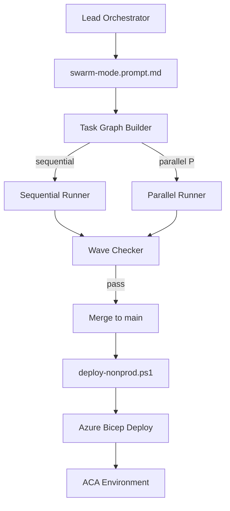

# how2 (simkplepetapp)

## PRD
Use Agent mode with a strong writing model.

1. Attach `idea.txt`
2. Prompt: `Let's create a PRD for this idea. Keep it relatively high level and put it in prd.md`

## Run locally (current WASM app)

```powershell
cd c:\Temp\GIT\simkplepetapp\MyPetVenues
dotnet run --urls "http://localhost:5050"
```

## Deploy to Azure Container Apps (ACA modernization)

Deployment is defined and implemented by `specs/001-aca-modernization/tasks.md` (infra + Dockerfile + deploy script are produced by those tasks).

### Run the ACA Lead Orchestrator (with swarm prompt)

1. Open Copilot Chat
2. From the custom agent dropdown, select **ACA Modernization Orchestrator**
3. In the chat window, add custom instructions: `#file:swarm-mode.prompt.md`
4. Send your request:

	`Execute specs/001-aca-modernization/tasks.md starting at T001.`

### Deploy (once US1 tasks have produced the infra + script)

Prereqs:
- Azure CLI installed and logged in: `az login`
- Docker installed/running (image build)

From repo root:

```powershell
cd c:\Temp\GIT\simkplepetapp
./scripts/deploy-nonprod.ps1
```

## Deployment flow (logical)



## Guardrails
- No secrets in repo/config; use Entra + managed identity (no keys/connection strings).