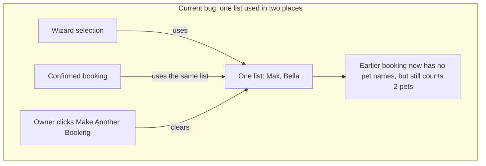
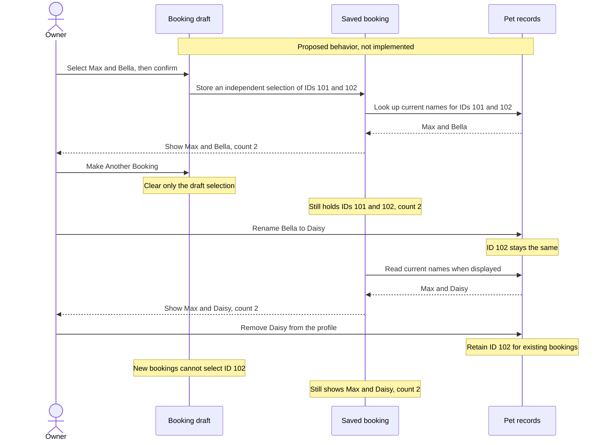

# Application improvement suggestions

Date: 2026-09-14

Reviewed branch: `structured-autonomy` at `ce60716`.

This is a current-code review, not a comparison diff. Findings come from source inspection. No builds or runtime tests ran. The changes below are proposals, not implemented fixes.

Fix booking ownership first. Then move pet ID allocation into the user service and give search one loading path. Keep the existing mock services.

## Agreed direction

Discussion decisions accepted on 2026-09-14:

- Include both bug fixes and missing product features. Fix booking data loss and pet identity first, then deliver the remaining work in stages.
- Keep booking in the application alongside venue submission, reviews, helpful votes, expanded discovery, and missing profile features. Update the PRD to remove its conflicting booking exclusion when recording the revised product requirements.
- Show current pet names and photos on all bookings, including completed and cancelled bookings. Renaming Bella to Daisy updates the displayed name on her existing bookings.
- Removing a pet excludes it from future selection but retains its record for existing bookings. It must not silently remove the pet from a reservation.
- Changes that affect venue eligibility or price require a separate booking review. Profile edits must not silently change the agreed reservation terms.

These decisions supersede the earlier suggestion to preserve pet names as they were at confirmation. A booking preserves which pets were selected, not historical display names.

The discussion is still defining the new feature workflows and booking review behavior. No application implementation has been authorized by this note.

## Agreed terminology

**Booking draft**:
The visit details an owner is choosing before confirmation. It is separate from any existing booking.
_Avoid_: Confirmed booking

**Confirmed booking**:
An accepted reservation for a venue visit with a particular selection of pets and agreed visit terms. The pets' displayed names and photos reflect their current profiles, rather than a historical copy.
_Avoid_: Booking draft

**Removed pet**:
A pet excluded from future booking selection but retained for existing bookings. Removing a pet from a profile is not a booking cancellation.
_Avoid_: Deleted booking

## Booking

After confirming a booking, clicking "Make Another Booking" erases the pet names from that confirmed booking. It does not delete the reservation itself: its pet count remains, but its pet-name list becomes empty.

For example, an owner books for Max and Bella. They can be two dogs or a dog and a cat. Their names are different, and selecting both works. The bug happens afterward, when the owner starts another booking.

```text
1. Select Max and Bella, then confirm.
  Saved booking: pet names = [Max, Bella], pet count = 2

2. Click "Make Another Booking".
  The wizard clears its selected-pets list.

3. Check the earlier booking.
  Expected: pet names = [Max, Bella], pet count = 2
  Actual:   pet names = [], pet count = 2
```

The wizard and saved booking refer to the same list in memory. Confirmation does not copy the list. Clearing the wizard's selection therefore also clears the saved booking's pet names. This affects a booking with even one selected pet; it does not depend on duplicate names or pet types.



The shared reference starts in [BookVenue.razor](../MyPetVenues/Pages/BookVenue.razor#L384). [BookingService.cs](../MyPetVenues/Services/BookingService.cs#L29) stores it unchanged.

### Proposed behavior: keep the pets, update their display details

A pet ID identifies the same pet even after a rename. In this example, ID 101 identifies Max and ID 102 identifies Bella. The numbers are illustrative.

The booking stores its own list of those IDs. It reads current names and photos from the pet records when displayed. This separates two things that must behave differently: resetting a draft must not change an earlier booking, but editing a pet's name must update that booking's display.



The booking service owns the saved pet selection. The user service owns pet identity and current profile details. Neither service should let a draft reset erase an existing booking's selection.

### What changes, and what stays

| Owner action | What changes | What must stay unchanged |
|---|---|---|
| Start another booking | The draft selection clears | Earlier bookings keep their selected pets and counts |
| Rename Bella to Daisy | All bookings containing that pet show Daisy, including completed and cancelled bookings | Pet ID, booking membership, count, and agreed terms |
| Change a pet photo | Bookings displaying that pet show the current photo | Selected pets and agreed terms |
| Remove Daisy from the profile | Daisy is unavailable for new bookings | Her retained record and membership in existing bookings |
| Change a detail affecting eligibility or price | The change requires a separate booking review | No automatic change to agreed terms; the review workflow is still open |

Acceptance scenarios for the agreed behavior:

1. Book with Max and Bella, click "Make Another Booking", and verify that the saved reservation still shows both names and a pet count of two. Repeat with one selected pet.
2. Rename Bella to Daisy in her profile. Verify that upcoming, completed, and cancelled bookings containing that pet show Daisy, without changing their selected pets or counts.
3. Update a pet's photo. Verify that bookings displaying that pet use the current photo.
4. Remove Daisy from the profile. Verify that existing bookings retain her and that new bookings cannot select her.
5. Change a pet detail that affects venue eligibility or price. Verify that it requires booking review rather than silently changing the agreed terms. The review workflow remains to be defined.

Separate improvements are to have the service enforce dates, counts, and pricing.

## Pet identity

[Profile.razor](../MyPetVenues/Pages/Profile.razor#L350) resets its counter whenever the page is recreated. The user service retains previously added pets.

```text
Current
  Open Profile and add a pet with ID 100.
  Leave Profile and return. The counter resets.
  Add another pet with ID 100.
  Edit by ID. The first match may be the wrong pet.

Proposed
  Profile submits pet details.
  User service allocates a unique ID and stores the pet.
  Profile edits that pet by its ID.
```

Test adding pets across repeated visits, then editing each independently. Stable IDs also let bookings follow profile renames without changing which pet was booked. They handle the unusual case of two pets sharing a name, but that edge case is not the cause of the confirmed-booking bug above.

## Search loading

[Venues.razor](../MyPetVenues/Pages/Venues.razor#L85) loads from initialization, parameter changes, and search handlers.

```diff
 Initialization
-  Load results

 Search or clear filters
   Update the URL
-  Load results

 OnParametersSetAsync
   Read filters from the URL
   Load results
```

This keeps direct links and button-driven searches on the same path. Test that each changed query triggers one search and reproduces the selected filters.

## Product gaps

These features are now in scope, but their workflows still need to be defined:

| Requirement | Current application |
|---|---|
| Add venues | No submission flow |
| Write reviews | Button has no handler |
| Helpful votes | Callback is not connected |
| Amenity/distance filters and map | Missing |
| Pet size, review history, and contributor reputation | Missing |
| Booking | Retained by agreement; the PRD exclusion needs updating |

Reconcile [prd.md](../prd.md) with these decisions before expanding functionality. Keep the existing mock-only service constraint unless a separate decision explicitly changes it. The confirmed state bugs can be fixed independently.

## Decisions still open

The scope and booking behavior above are agreed. The following recommendations were proposed afterward and have not yet been accepted:

| Question | Recommendation awaiting a decision |
|---|---|
| Who reviews eligibility or price changes? | Have the venue review affected upcoming bookings and notify the owner. Do not reopen completed or cancelled bookings. |
| Who approves submitted venues? | An administrator approves or rejects pending submissions, with mock roles for the demo. |
| Who can review and vote? | Allow one editable review per signed-in owner per venue without requiring a booking, plus optional photos and amenity ratings. Allow one reversible helpful vote per other owner. |
| Where does distance search start? | Let the owner choose a location or use their current position. Apply the same location and filters to map and list results. |
| What earns contributor badges? | Start with the first approved venue submission and first published review. Defer points and rankings. |