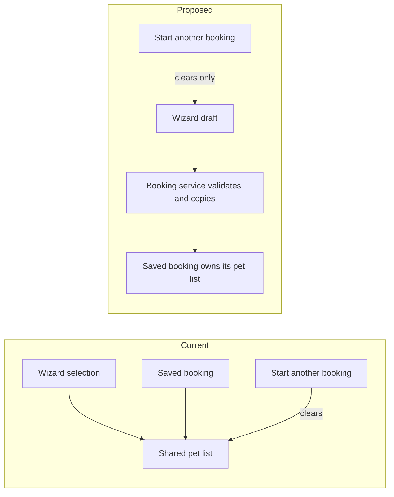

# Application improvement suggestions

Date: 2026-09-14

Reviewed branch: `structured-autonomy` at `ce60716`.

This is a current-code review, not a comparison diff. Findings come from source inspection. No builds or runtime tests ran. The changes below are proposals, not implemented fixes.

Fix booking ownership first. Then move pet ID allocation into the user service and give search one loading path. Keep the existing mock services.

## Booking

The wizard and saved booking currently share the same pet list. Starting another booking clears both.



The shared reference starts in [BookVenue.razor](../MyPetVenues/Pages/BookVenue.razor#L384). [BookingService.cs](../MyPetVenues/Services/BookingService.cs#L29) stores it unchanged.

Test the fix by booking with two pets, restarting the wizard, and checking that the saved reservation still contains both. The service should also enforce dates, counts, and pricing.

## Pet identity

[Profile.razor](../MyPetVenues/Pages/Profile.razor#L350) resets its counter whenever the page is recreated. The user service retains previously added pets.

```text
Current
  Open Profile and add a pet with ID 100.
  Leave Profile and return. The counter resets.
  Add another pet with ID 100.
  Edit by ID. The first match may be the wrong pet.

Proposed
  Profile submits pet details.
  User service allocates a unique ID and stores the pet.
  Profile edits that pet by its ID.
```

Test adding pets across repeated visits, then editing each independently. Booking selections should also use IDs, since pet names need not be unique.

## Search loading

[Venues.razor](../MyPetVenues/Pages/Venues.razor#L85) loads from initialization, parameter changes, and search handlers.

```diff
 Initialization
-  Load results

 Search or clear filters
   Update the URL
-  Load results

 OnParametersSetAsync
   Read filters from the URL
   Load results
```

This keeps direct links and button-driven searches on the same path. Test that each changed query triggers one search and reproduces the selected filters.

## Product gaps

These need a scope decision, not an architecture refactor:

| Requirement | Current application |
|---|---|
| Add venues | No submission flow |
| Write reviews | Button has no handler |
| Helpful votes | Callback is not connected |
| Amenity/distance filters and map | Missing |
| Booking | Implemented, but excluded by the PRD |

Reconcile [prd.md](../prd.md) with the documented mock application before expanding functionality. The confirmed state bugs can be fixed independently.