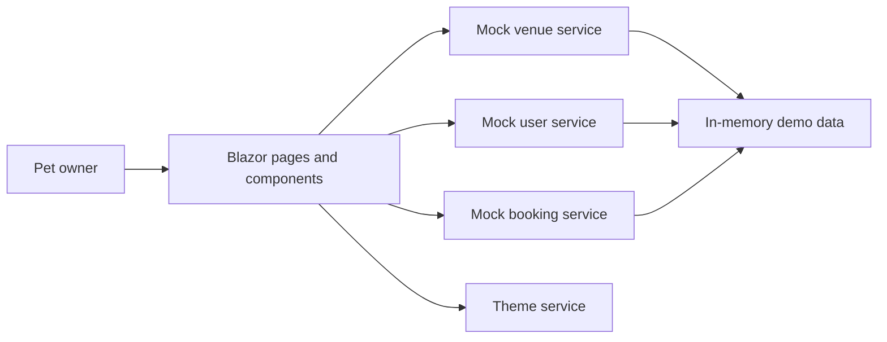
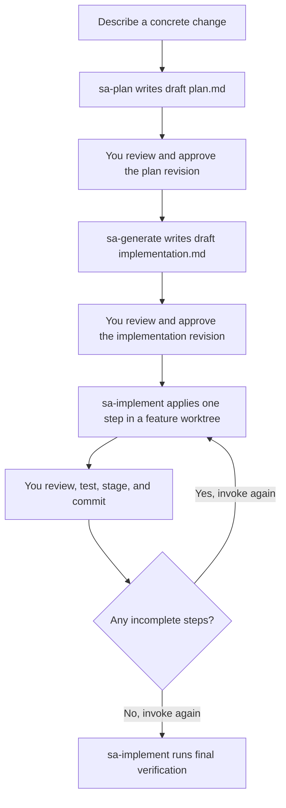

# MyPetVenues on structured-autonomy

This README describes the `structured-autonomy` branch. It contains a Blazor WebAssembly demo for finding pet-friendly venues and a custom-agent workflow for developing changes through approved plans and reviewed implementation steps.

## What the application does

MyPetVenues helps pet owners browse venues, inspect venue details and reviews, save favorites, and create demo bookings. It includes a profile for a sample user and their pets, plus light and dark themes.

| Route | What you can do |
| --- | --- |
| `/` | Browse featured venues and categories, or start a search. |
| `/venues` | Search and filter venues by search text, venue type, and pet type. |
| `/venues/{id}` | Read venue details and reviews, toggle a favorite, or start a booking. |
| `/booking` | Select a venue, date, times, and pets, then confirm a demo booking. |
| `/profile` | Edit the sample profile, add or edit pets, view favorites, and view or cancel bookings. |

The application runs in the browser. [MyPetVenues/Program.cs](MyPetVenues/Program.cs) registers mock venue, booking, and user services. These services use in-memory data. Bookings and favorites are demo state, not reservations or records saved to a backend. Reloading the application resets that state. There is no production authentication, payment processing, or database in this branch.

The product idea and requirements live in [idea.txt](idea.txt) and [prd.md](prd.md). Treat those documents as product intent, not proof that every described capability exists.



## Build and run this branch

You need Git and the .NET SDK selected by [global.json](global.json). The SDK version is `10.0.111`, with `latestPatch` roll-forward. The application still targets `net9.0` and pins runtime assets to `9.0.15` in [MyPetVenues/MyPetVenues.csproj](MyPetVenues/MyPetVenues.csproj). The SDK version and application target are different on purpose in these instructions; do not substitute an arbitrary SDK version.

From the repository root, check that you are on `structured-autonomy`, then restore and build the application project.

```powershell
git branch --show-current
dotnet --version
dotnet restore MyPetVenues/MyPetVenues.csproj
dotnet build MyPetVenues/MyPetVenues.csproj --no-restore
dotnet run --project MyPetVenues/MyPetVenues.csproj --launch-profile http
```

Open <http://localhost:5039>. If that port is occupied, choose an unused port explicitly.

```powershell
dotnet run --project MyPetVenues/MyPetVenues.csproj --launch-profile http --urls http://localhost:5040
```

[NuGet.config](NuGet.config) selects nuget.org for restore. No API keys or cloud subscription are required to run the demo. If restore reports missing framework or runtime packs, check the versions pinned in the project before changing them.

VS Code also provides the `build (MyPetVenues)` and `run (MyPetVenues)` tasks. Custom agents are optional for compiling and running the application. They organize development work; `dotnet` performs the build.

## Develop changes with custom agents

Open this repository in VS Code with GitHub Copilot Chat. Select the agent by its name in the agent picker. The three `sa-*` agents require explicit selection and do not automatically invoke one another. Handoff buttons prepare the next request, but do not grant approval.

| Agent | What it does | What it does not do |
| --- | --- | --- |
| [sa-plan](.github/agents/structured-autonomy-plan.agent.md) | Researches the requested change, asks about material ambiguities, and writes `plans/<feature-name>/plan.md`. Defines scope, affected code, a feature branch, a base branch, and verification steps. | Does not edit application code or write the implementation document. |
| [sa-generate](.github/agents/structured-autonomy-generate.agent.md) | Expands an approved plan into its sibling `implementation.md`, with exact edits, checkboxes, verification commands, and review checkpoints. | Does not run builds, edit application code, create branches, or start implementation. |
| [sa-implement](.github/agents/structured-autonomy-implement.agent.md) | Checks both approvals and revision consistency, creates or reuses a sibling feature worktree, applies the first incomplete step, validates it, and records progress. | Does not continue past the step's review checkpoint, commit, push, or open a pull request. |
| [Debugger](.github/agents/Debugger.agent.md) | Reproduces a reported bug, investigates its cause, applies a focused fix, and verifies the result. | Is not a stage in the approval workflow. Its instructions do not provide the same plan and worktree gates as `sa-implement`. |

`sa-plan` and `sa-generate` use the `Explore` subagent for focused repository research. They fall back to direct reads and searches if it is unavailable. `Explore` is a VS Code-provided helper, not another custom-agent file in this repository. `sa-implement` does not delegate.

The agent files request specific models. Your Copilot account needs access to those models or a supported alternative configured for your environment. The planning agents can also consult Microsoft Learn and Context7 when relevant. If a documentation provider is unavailable, they must disclose that limitation.



### Example walkthrough

The language-selection request in [how2.md](how2.md) is a useful example of a development task. It is not a claim that localization already exists in this branch.

1. Select `sa-plan` and submit a concrete request. To base the feature on the branch described here, name `structured-autonomy` as the base explicitly.

   ```text
   Plan a Home page language selector for English and Russian.
   Use structured-autonomy as the base branch and home-language as the feature name.
   Persist the selection in browser storage. Limit translation to the Home page.
   Use the mypetvenunes skill for repository conventions and show-me for the data flow.
   Do not implement yet.
   ```

2. Review the resulting `plans/home-language/plan.md`. Resolve open questions, then tell `sa-plan` to approve its current revision. For example, `I approve plan revision 1.` The agent records `Status: Approved`. Feedback that changes the plan increments its revision and returns it to `Draft`.

3. Select `sa-generate`, attach the approved plan, and ask it to generate the sibling implementation document. Review the exact edits and checks, then explicitly approve that document's current revision in a later turn. Both documents must be approved, and the implementation's source-plan revision must match the plan.

4. Select `sa-implement`, attach the approved `plans/home-language/implementation.md`, and ask it to execute the first incomplete step. It works on `feature/home-language` in a sibling worktree such as `../simplepetapp-home-language`. It leaves the primary checkout on its current branch. If the tools cannot access the new worktree, add that folder to the VS Code workspace when requested.

5. Review the changes and verification results. Stage and commit the product changes in the feature worktree yourself. Invoke `sa-implement` again after each checkpoint until the implementation steps are complete, then invoke it for final verification. Failed or unperformed checks remain unchecked.

The original implementation document remains the sole progress record in the primary workspace. The executor updates its checkboxes there, even if the feature worktree has another copy. If relevant product changes are uncommitted in the primary checkout, the executor stops because a new worktree would not contain them.

For side-by-side testing, keep the original app running and run the feature worktree's app on a different unused loopback port. The executor must not replace the original server. Different ports also keep browser storage separate.

## Skills in this repository

Agents define roles, allowed tools, and handoffs. Skills provide instructions for a particular task. Their presence does not mean every skill runs on every request, and a skill cannot widen an agent's allowed scope. Mention a skill by name or attach its `SKILL.md` when you want to use it explicitly.

| Skill | When to use it and what it contributes |
| --- | --- |
| [mypetvenunes](.github/skills/mypetvenunes/SKILL.md) | Application changes. Describes service interfaces and dependency injection, Razor components with scoped CSS, theme variables, and the venue, user, booking, and review models. The folder name retains the repository's spelling. |
| [codebase-design](.github/skills/codebase-design/SKILL.md) | Module design or testability decisions. Provides principles for small interfaces that hide substantial implementation complexity. It does not request a repository-wide survey. |
| [improve-codebase-architecture](.github/skills/improve-codebase-architecture/SKILL.md) | An explicit architecture survey. Produces an evidence-backed HTML report of candidates, then waits for a selection before exploring a candidate further. |
| [domain-modeling](.github/skills/domain-modeling/SKILL.md) | Terminology and domain decisions. Helps maintain a domain glossary in `CONTEXT.md` and record architecture decision records. |
| [grilling](.github/skills/grilling/SKILL.md) | Stress-testing a plan or idea through pointed questions before committing to an approach. |
| [grill-with-docs](.github/skills/grill-with-docs/SKILL.md) | A design interview that also records decisions and glossary entries. Use outside a restricted planning stage if it needs to write additional documents. |
| [diagnosing-bugs](.github/skills/diagnosing-bugs/SKILL.md) | Hard or intermittent bugs, named performance regressions, or a defect that survives a focused first fix. Requires reproduction evidence, falsifiable hypotheses, and focused checks. |
| [code-review](.github/skills/code-review/SKILL.md) | Reviewing committed changes since a branch, tag, commit, or merge-base. Runs separate standards and specification reviews in parallel subagents and reports both. |
| [show-me](.github/skills/show-me/SKILL.md) | Explaining a workflow, dependency, or design visually. Chooses a concise diagram, code sketch, file tree, or focused HTML artifact. This README uses Mermaid for the application and agent flows. |
| [unslop](.github/skills/unslop/SKILL.md) | Editing prose. Removes vague claims, filler, decorative language, and other AI writing patterns. This README applies it to keep descriptions concrete. |
| [retro](.github/skills/retro/SKILL.md) | Reflecting on a coding session and identifying lessons for later work. |
| [skill-creator](.github/skills/skill-creator/SKILL.md) | Creating or updating reusable skills, including their instructions, supporting resources, and packaging. |

`improve-codebase-architecture`, `grill-with-docs`, `retro`, and `unslop` set `disable-model-invocation: true`. Request those skills explicitly. For example, attach the `show-me` and `unslop` skill folders and ask for a workflow explanation with a diagram and plain prose.

Repository-wide development guidance is in [.github/instructions/copilot-instructions.md](.github/instructions/copilot-instructions.md). UI design guidance is in [.github/instructions/frontend-design.instructions.md](.github/instructions/frontend-design.instructions.md). These instruction files are distinct from the selectable agents and task-specific skills.

## Where the code lives

| Path | Responsibility |
| --- | --- |
| [MyPetVenues/Pages](MyPetVenues/Pages) | Home, venue discovery, venue details, booking, and profile screens. |
| [MyPetVenues/Components](MyPetVenues/Components) | Venue cards, search filters, ratings, reviews, and badges. |
| [MyPetVenues/Services](MyPetVenues/Services) | Mock data operations, user state, bookings, and theme state. |
| [MyPetVenues/Models](MyPetVenues/Models) | Venue, user, booking, and review types. |
| [MyPetVenues/Layout](MyPetVenues/Layout) | Shared page layout, header, and footer. |
| [MyPetVenues/wwwroot](MyPetVenues/wwwroot) | Browser entry point, global CSS, and static images. |
| [.github/agents](.github/agents) | The four custom-agent definitions described above. |
| [.github/skills](.github/skills) | The twelve repository skills and their supporting files. |

## Verification expectations

Build the application project with the command above. A successful build does not establish that the browser workflows work. Check venue discovery, venue details, favorites, demo booking, profile state, and theme switching when a change touches them. For UI work, include desktop and mobile layouts and light and dark themes.

The branch does not currently provide an automated test project or a checked-in Playwright test suite. Plans should name the checks a change needs and distinguish proposed checks from checks actually run. Do not treat `dotnet test` with no tests as acceptance evidence.